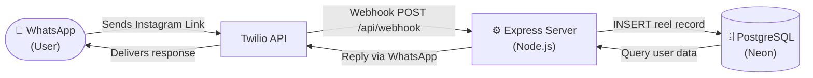

# 🎬 Social Saver — Your Instagram Memory, Supercharged

> Send any Instagram Reel to our WhatsApp bot — it automatically processes it, summarizes it with AI, and displays it on your personal dashboard where you can search, filter, and revisit your saves anytime.

---

## 😤 The Problem with Instagram Saves

You're scrolling Instagram and a Reel stops you — a perfect recipe, a coding trick, a workout routine. You hit **Save** thinking                                                                                    *"I'll come back to this."* You never do.

You hit Save on a Reel. Full intention of coming back to it. Here's what actually happens.

### 🧠 You forget *why* you saved it

Instagram saves the video. It saves nothing else — no summary, no context, no note about why it felt important. Days later, it's just a thumbnail. Re-watching 200 Reels to find the one you needed isn't something anyone actually does.

> **The intention was real. Instagram just didn't capture it.**

### 🔍 Finding it later is nearly impossible

You remember saving a pasta recipe — somewhere in the last month. You open your Saved tab. **300 posts. No search bar. No keyword filters.** Your only option is to scroll manually, one post at a time, hoping you recognise the right thumbnail before frustration wins.

> **You own 300 saves and can't find a single specific one.**

---

## 🆕 But Wait — Didn't Instagram Just Add Collections?

Yes. Instagram recently introduced **custom Collections** — named folders where you can manually sort your saves into categories like `Recipes` or `Coding`.

It's a step in the right direction. But it still doesn't fix the real problem.

| | Instagram Collections | Social Saver |
|---|---|---|
| **Categorization** | Manual — you do it every time | Automatic — AI does it instantly |
| **Summaries** | ❌ None — re-watch to remember | ✅ AI-generated for every save |
| **Search** | ❌ No keyword search | ✅ Full-text search on dashboard |
| **Reminders** | ❌ None | ✅ Set via WhatsApp bot |
| **Access** | Instagram app only | WhatsApp + Web Dashboard |

> **Collections fix the folder problem. They don't fix the forgetting problem.**

You still have to manually categorize every single save, in the moment, every time. You still can't search inside your saves. You still have no summary telling you why a Reel mattered. And you still get no reminders to ever go back.

---

## 💡 How Social Saver Fixes This

The workflow is simple — **WhatsApp in, Dashboard out.**
```
Send IG link via WhatsApp  →  Bot processes it  →  Appears on your Dashboard
```

The moment you send an Instagram Reel link to the WhatsApp bot, Social Saver automatically:

- 🤖 **Summarizes it with AI** — a 1–2 sentence capture of exactly what the Reel is about and why it matters
- 🏷️ **Assigns a real-world category** — `Cooking`, `Coding`, `Gym`, `Finance`, `Jobs` and more
- 💾 **Saves it to your personal dashboard** — every processed Reel appears instantly on your web dashboard, tied to your WhatsApp number
- 🔍 **Makes it fully searchable** — find any saved Reel by keyword, topic, or category in seconds from the dashboard
- 🔔 **Lets you set reminders** — get notified via WhatsApp so saved content actually gets used

No more forgotten saves. No more endless scrolling.
**Just send the link — and find it in seconds on your dashboard.**
---

## 📌 Submission

| | |
|---|---|
| **GitHub** | [Insert GitHub Repository Link Here] |
| **Demo Video(with subtiles and watermark)** | https://drive.google.com/drive/folders/1FrqnepFq5g_aiSmIzmqSSTY_ZgBs247e?usp=sharing |
| **Demo Video(without subtiles and watermark)** | https://drive.google.com/drive/folders/1IAdbcwAEPZaKF3Gq-jXMh294hX6Dw0Vz?usp=sharing |

---

## 🏗️ System Architecture


---

### Data Extraction & Processing Pipeline


```
```
### WhatsApp → Database Connection



---

## 📋 Evaluation Criteria

### ✅ Explainability
- **Summaries**: Gemini 1.5 Flash distills captions + hashtags into a focused 1-2 sentence takeaway.
- **Categories**: Assigns real-world labels (e.g., `Cooking`, `Fitness`, `Finance`) — not vague genre tags.
- **Intent**: Classifies the creator's goal — `Educational`, `Promotional`, `Inspirational`, etc.
- **Vision Support**: For static posts (`/p/`), the thumbnail is fetched and sent inline to Gemini as base64 image data, enabling multimodal classification even without captions.
- **Schema Enforcement**: AI response is validated against a strict JSON schema — malformed or vague outputs are rejected.

### ✅ System Architecture & Engineering
- **Async Pipeline**: Twilio gets an instant `200 OK`. Apify scraping + Gemini inference run asynchronously in the background.
- **Separation of Concerns**: Ingestion → Extraction → Classification → Persistence are fully independent layers.
- **Edge Case Handling**:
    - Duplicate links → detected and handled without re-processing.
    - Failed pipeline → user can re-send the link to retry.
    - Missing captions → fallback to username/hashtag analysis.
    - Twilio sandbox limit errors → caught gracefully without crashing.

### ✅ Usability & Presentation
- **Zero Passwords**: Dashboard login uses WhatsApp OTP — no accounts needed.
- **Omni-Channel**: Users can interact entirely from WhatsApp (save, remind, view recent), or use the rich web dashboard.
- **Low Friction**: First-time onboarding is one WhatsApp message. No app install required.

### ✅ Code Integrity
- All core logic (state machine, async pipeline, AI prompts, SQL schema, dashboard UI) was built from scratch during this hackathon.
- External services used (clearly attributed):
    - `@google/generative-ai` — LLM inference
    - `apify-client` / `axios` — Instagram metadata scraping
    - `twilio` — WhatsApp messaging
    - `pg` — PostgreSQL driver (Neon Serverless)
    - `express` — HTTP routing

---
## 🚀 Tech Stack

### 🖥 Backend


### 🗄 Database


### 🤖 AI & Automation


### 📩 Messaging & Scraping


### 🎨 Frontend


- Confirm Apify token is valid.
- Ensure Instagram link is public.
- For WhatsApp webhook: expose port `3000` via **ngrok** and set the Twilio Sandbox webhook URL to `https://<ngrok-url>/api/webhook`.


## 📁 Project Structure

```
src/
├── server.js                 # Entry point, starts server + reminder cron job
├── app.js                    # Express setup, middleware, route binding
├── config/
│   ├── db.js                 # PostgreSQL connection pool
│   └── ai.js                 # Gemini AI client initialization
├── controllers/
│   ├── webhook.controller.js # Conversational state machine + pipeline orchestrator
│   ├── reel.controller.js    # Dashboard REST endpoints (list, delete, star)
│   └── auth.controller.js    # OTP generation and verification
├── services/
│   ├── apify.service.js      # Instagram metadata scraper (Apify)
│   ├── ai.service.js         # Gemini multimodal analysis
│   ├── twilio.service.js     # WhatsApp message dispatcher
│   ├── reel.repository.js    # Reel DB queries (CRUD + SQL)
│   └── user.repository.js    # User and Auth OTP DB queries
├── jobs/
│   └── reminder.job.js       # Cron job: checks & sends pending reminders
├── middleware/
│   ├── asyncHandler.js       # Promise rejection wrapper
│   └── error.middleware.js   # Global error handler
└── utils/
    ├── linkParser.js         # Extracts Instagram links from WhatsApp text
    └── dateParser.js         # NLP for reminder times ("tomorrow at 6pm")
client/                       # Vanilla JS/HTML/CSS dashboard frontend
```

---

## 🛠️ Local Setup Guide

Follow the steps below to run **Social Saver Bot** on your local system.

---

### 📋 System Requirements

Make sure you have the following installed and configured:

| Requirement | Details |
|---|---|
| **Node.js** | v18 or higher |
| **PostgreSQL** | via [Neon](https://neon.tech/) (Serverless) |
| **Twilio** | Account with WhatsApp Sandbox enabled |
| **Gemini API** | Key from [Google AI Studio](https://ai.google.dev/) |
| **Apify** | API Token from [Apify](https://apify.com/) |
| **ngrok** | For exposing local webhook to Twilio |

---

### 📦 Step 1 — Clone the Repository
```bash
git clone https://github.com/kolahalasudheer/social-saver-bot.git
cd social-saver-bot
```

---

### 📥 Step 2 — Install Dependencies
```bash
npm install
```

---

### 🔐 Step 3 — Configure Environment Variables

Create a `.env` file in the root directory:
```bash
touch .env
```

Add the following configuration:
```env
PORT=3000

# Database (Neon - Serverless PostgreSQL)
DATABASE_URL=your_neon_connection_string

# Twilio
TWILIO_ACCOUNT_SID=your_twilio_sid
TWILIO_AUTH_TOKEN=your_twilio_auth_token
TWILIO_WHATSAPP_NUMBER=whatsapp:+14155238886

# AI
GEMINI_API_KEY=your_gemini_api_key

# Scraping
APIFY_API_TOKEN=your_apify_api_token

# Dashboard
DASHBOARD_URL=http://localhost:3000
```

> ⚠️ **Never commit your `.env` file.** Add it to `.gitignore` to keep credentials safe.

---

### 🗄️ Step 4 — Database Setup (Neon)

1. Create a new project at [neon.tech](https://neon.tech/)
2. Copy your **connection string** and paste it into `DATABASE_URL`
3. Create the required tables in your database:
   - `users`
   - `reels`
   - `otps`

You can run the SQL using any of these tools:
- **Neon SQL Editor** (built-in, easiest)
- **pgAdmin**
- **TablePlus**

---

### ▶️ Step 5 — Start the Server

Development mode (with auto-reload):
```bash
npm run dev
```

Or production start:
```bash
node src/server.js
```

Server will be running at:
```
http://localhost:3000
```

---

### 🌍 Step 6 — Expose Server via ngrok (twilio cant recive the messages directly via express)

Twilio requires a public HTTPS endpoint to send webhook events. Start ngrok:
```bash
ngrok http 3000
```

Copy the generated **HTTPS URL** (e.g. `https://abc123.ngrok.io`) — you'll need it in the next step.

---

### 📲 Step 7 — Configure Twilio Webhook

1. Go to **Twilio Console → Messaging → Try it Out → WhatsApp Sandbox Settings**
2. Under **"When a message comes in"**, set:

| Field | Value |
|---|---|
| **Webhook URL** | `https://your-ngrok-url/api/webhook` |
| **Method** | `HTTP POST` |

3. Click **Save**

---

### 🧪 Step 8 — Test the Bot

1. Send your Twilio sandbox join code from WhatsApp (e.g. `join <word>-<word>`)
2. Send any **Instagram Reel or Post link** to the WhatsApp number
3. The system will automatically:
   - Scrape reel metadata via **Apify**
   - Generate AI summary + category via **Gemini**
   - Store the result in **Neon PostgreSQL**
   - Send a reply back via **WhatsApp**
4. Visit `http://localhost:3000` to view your **web dashboard**

---

### 🛠️ Troubleshooting

<details>
<summary>❌ Webhook not receiving messages?</summary>

- Ensure `ngrok` is running and the tunnel is active
- Confirm the Twilio webhook URL exactly matches your ngrok HTTPS link
- Verify `HTTP POST` is selected as the method in Twilio settings

</details>

<details>
<summary>❌ Database connection error?</summary>

- Double-check `DATABASE_URL` in your `.env` file
- Ensure your Neon project is active and not suspended
- Confirm `?sslmode=require` is appended to the connection string

</details>

<details>
<summary>❌ WhatsApp bot not responding?</summary>

- Make sure you've joined the Twilio sandbox by sending the join code first
- Confirm the WhatsApp number format is `whatsapp:+14155238886`
- Check the server logs for any runtime errors

</details>

---

### ✅ Setup Complete

Your **Social Saver Bot** is now running locally. Send an Instagram link to your WhatsApp bot and watch it work!
Login via OTP and view saved reels.

---
